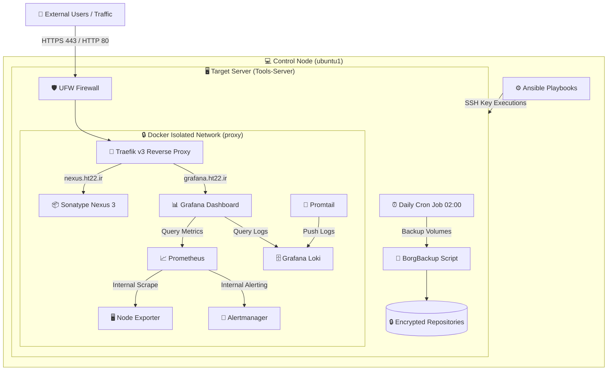

# 🏗️ Infrastructure Architecture Diagram

این سند شامل دیاگرام و معماری تفصیلی زیرساخت پروداکشن (Target Node) و نحوه اتصال Control Node و کاربران است.

---

## 📐 دیاگرام کلی معماری (System Overview)

---

## 🔍 شرح جریان ترافیک و اجزا

1. **لایه ورودی (Ingress):** تنها درخواست‌های مربوط به دامنه‌های عمومی ( و ) از طریق پورت‌های 80/443 توسط Traefik هدایت می‌شوند.
2. **لایه سرویس‌های داخلی:** سایر سرویس‌ها (Prometheus، Alertmanager، Loki) دامنه‌ی عمومی نداشته و فقط به عنوان سرویس‌های داخلی در شبکه ایزوله داکر به یکدیگر و به Grafana پاسخ می‌دهند.
3. **لایه مدیریت و اتوماسیون:** سرور  از طریق SSH و کلید امنیتی، پیکربندی‌ها را روی سرور مقصد اعمال می‌کند.
