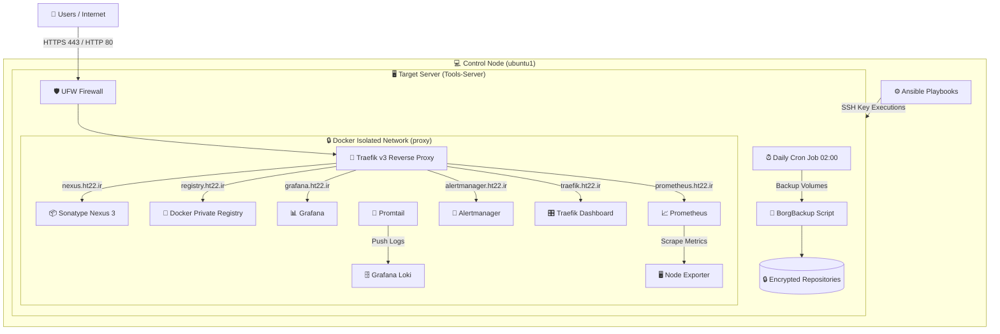

# 🏗️ Infrastructure Architecture Diagram

این سند شامل دیاگرام و معماری تفصیلی زیرساخت پروداکشن (Target Node) و نحوه اتصال Control Node و کاربران است.

---

## 📐 دیاگرام کلی معماری (System Overview)

---

## 🔍 شرح جریان ترافیک و اجزا

1. **لایه ورودی (Ingress):** تمام درخواست‌های کاربران ابتدا به UFW Firewall رسیده و تنها پورت‌های 80 و 443 به سمت Traefik هدایت می‌شوند.
2. **لایه Reverse Proxy:** سرویس Traefik به صورت هوشمند و بر اساس SNI/Host Header، ترافیک را به کانتینر مربوطه در شبکه ایزوله proxy هدایت می‌کند.
3. **لایه مانیتورینگ و لاگینگ:**
   - Prometheus: اطلاعات متریك سیستم و کانتینرها را جمع‌آوری می‌کند.
   - Promtail & Loki: لاگ‌های متنی سیستم‌عامل و تمام کانتینرها را جمع‌آوری و برای نمایش به Grafana می‌فرستد.
4. **لایه مدیریت و اتوماسیون:** سرور ubuntu1 از طریق SSH و کلید امنیتی، تغییرات و رول‌های انسیبل را روی Target اجرا می‌کند.
